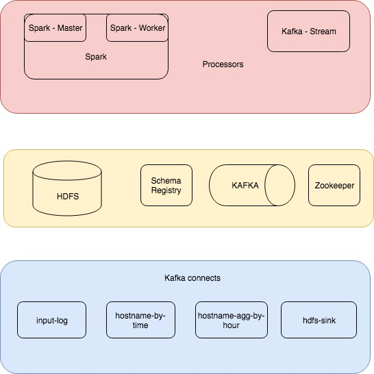

# Log Processor

## Architecture for parse log files and do two uses cases.

Use case one: The solution should read files from an input path and request events with filters for logs and return result to another topic.
Use case two: The solution should read read topic with input logs and request in another topic. It should agreggates according to a hostname provided in a second topic and send the result to another topic every hour.

The entire challenge is in email of introduction.

Solution assumptions:

    - Should be scalable.
    - Should have the minor dependencies as possible: (Only docker and UNIX terminal is required).
    - Should run indefinitely.

  Proposed architecture:

 

A cli was provided with the project to run and pass tests.

Cli steps:

- **bootstrap**:
    Compile source code in folder code and save executables in jar format to shared folder ".bootstrap" that will be linked to spark-master and kafka-stream dockers.
        
- **run**:
    Launch docker-compose with solution. All config is in docker-compose.yml file.
    
- **start_connects**:
    Run connects (input-log, hostname-by-time, hostname-agg-by-hour and hdfs-sink) in connect docker. More info in [connects](docs/connects/connects.md)
    
- **start_processes**:
    Launch Kafka stream process and spark process that do each use case. Spark resolve use case one and kafka stream use case two. More info in [processes](docs/processes/processes.md)
    
- **init_env**:
    Do bootstrap, run, start_connects and start_process steps in one instruction.
        
- **tests**: 
    Launch tests at. It was done with cucumber. More info in: [tests](docs/tests/tests.md)
        
- **logs**:
    Exec instruction to show logs from all architecture.
        
- **stop**:
    Stop all containers and delete used or processed data.
    
    
# Default execution:

    ./cli init_env tests

 